# Nodes

## amr_interface_node

This node allows to get serial communication working between hardware and ROS2.  
It can manage:
- joints
- odometry
- imu
- battery

 

To run: 
`ros2 run ros2_amr_interface amr_interface_node`
  
if you need to change serial port and remap a topic: 
`ros2 run ros2_amr_interface amr_interface_node --ros-args -p port_name:=<your port> --remap /amr/cmd_vel:=/cmd_vel`

 

Here a scheme of communication messages:  

---

> ***Copyright (c) 2022 G. Bruno under MIT license***